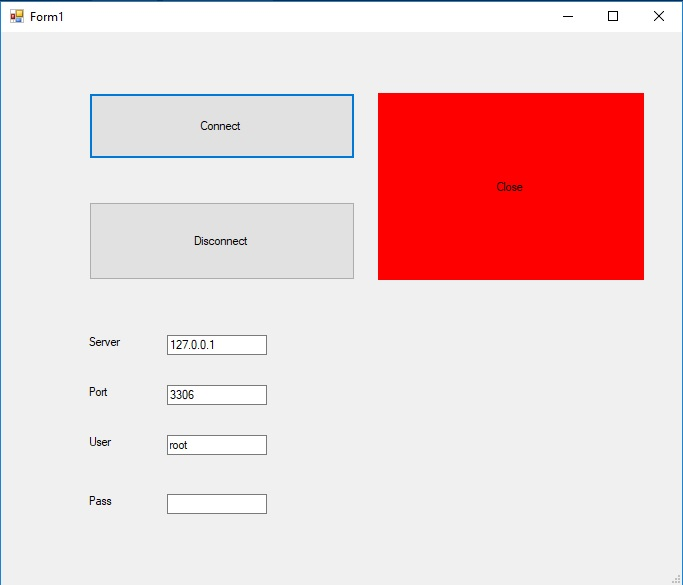
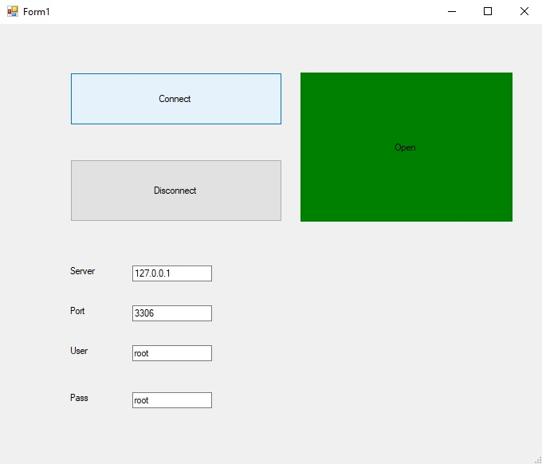
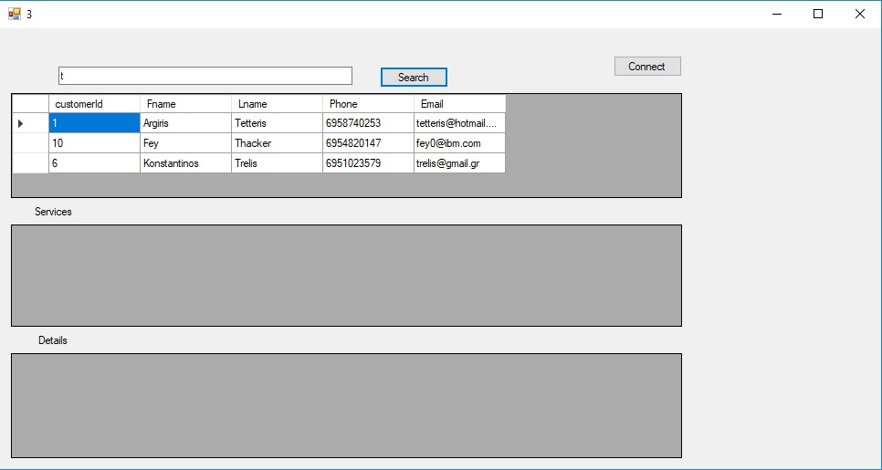
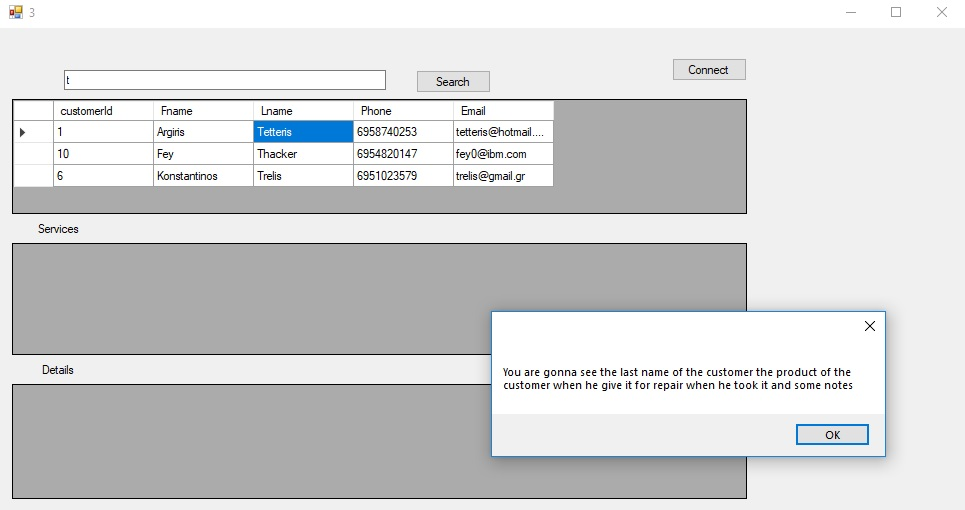
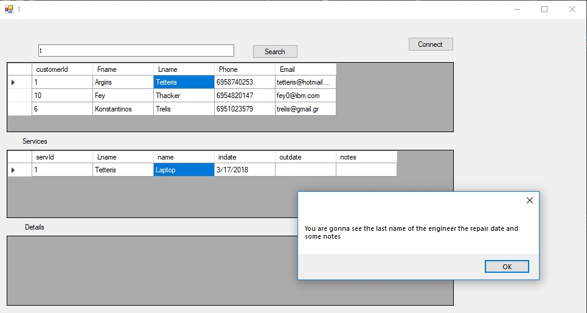
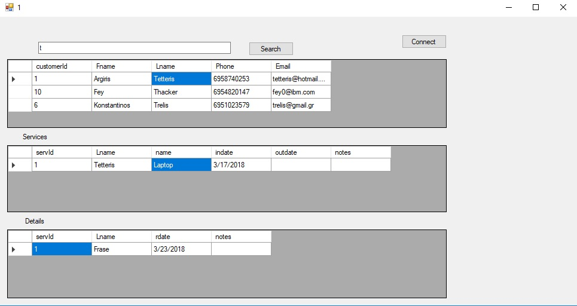

# WindowsFormApp

## Windows App C#

I build a simple Windows App in C# that can read data from the database.
Also you have a search bar that you can search for a specific customer.

### Guide

When you start the App the first form that you will see is the connection form.
You must fill the fields with the appropriate informations. 

When you fill all the fields correctly you will ready to connect to your database.

When you will connect successfully, close the form and you will see the next form that it's,
the main form of the App which you can search your customers.
I have to say that the search properties is by Last Name of the customers.

When you are ready to write something in the search bar click the search button to see the results.
Before the results shows up a Pop-Up window will alert you for what are you going to see.
I have that in every step because i want you to understand the structure of my database.

When you click on a cell you will see additional informations related with the cell that you clicked on the next grid

Finally we have an App that give us additional information about a customer and his product at 3 different grids 
where they are related each other. 

